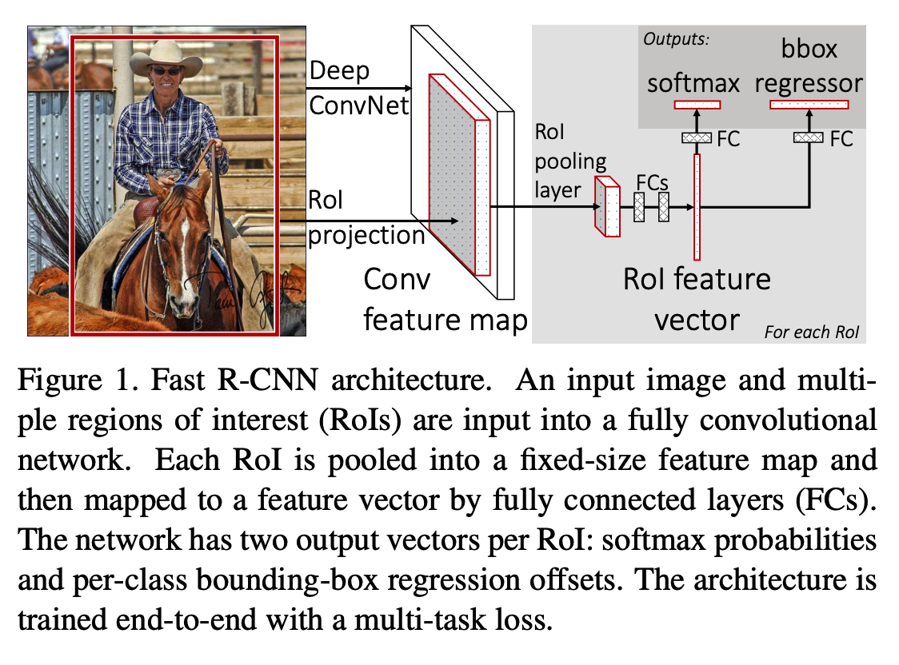

## 摘要总结
1.9倍的训练速度@比起RCNN

2.213倍的测试速度@比起RCNN

3.在PASCAL VOC 2012上面取得了更高的mAP。

1.比如SPPnet，训练VGG16三倍的速度。

2.测试10倍速度@SPPnet

3.更准确。

# RoI Pooling成立的一个条件
就是咱们的卷积层都加上了一个pad=1.这样的话只有pooling层会对其产生影响。

## 总结: 之前方法的缺陷

### compared with RCNN:

1.训练是一个Multi-stage pipeline. 这里就是ConvNet on object proposals using log loss。然后用SVM来进ConvNet features。

1）finetuning；2）SVM；3）然后bbx regressors。

2.训练是expensive in space and time。所有的关于SVM的我们都需要送到disk里，而这个就是消耗hundreds of gigatypes of storage.

3.Object Detection is slow: 测试时间对于RCNN而言，features are extracted from each object proposals所以一般VGG16需要耗时47s/Image。

### compared with SPPNet：
这个比起RCNN就是10到100的测试速度+++，然后训练时间就是减少了3倍的时间@@faster proposal feature extraction。

1.这里的一个核心的问题就是微调并不能更新卷积layers precede spatial pyramid pooling（不能利用好之前说的conv finetuning的过程）

## 我们方法的contributions
Fast-RCNN就是说comparatively fast to训练以及测试～

1.更高的检测质量mAP 比起RCNN/SPPNet。

2.训练是single-step的，使用的是multi-task loss.

3.训练可以更新所有的网络layers。

4.对于特征缓存没有任何disk storage是需要的。feature caching。

## Fast R-CNN架构以及训练方式
1.网络就是输入entire image作为输入以及a set of object proposals。

1）conv feature map。

2）对于每个object proposal，我们都是ROI Pooling产生fixed-size feature vectors。

3）最后的FC不一样，每个feature vector都会输入至序列级别的全连接层@这个会划分为两个sibling output layers：
-一个就是K+1的softmax layer（1表示catch-all‘background’ class；
-一个就是4 real-valued numbers for each of the K object classes.

## 1.RoI pooling layer@core（a special case of spp layer）
这层的核心目的就是max pooling将每个ROI的feature转化为小的feature map with a fixed spatial extent of (H x W): 比如7x7.

那么这里的H和W是超参数，和任何的RoI无关。RoI的定义方式就是一个four-tuple(r,c,h,w),top-left corner(r,c) and its height and width(h,w).

feature map中的一个矩形区域就是ROI。

ROI max pooling的核心就是divide整个图像划分成HxW个grid，具体的划分矩形大小由我们所决定，然后使用maxpooling。

## 2.Initialize from 预训练网络。（ROI pooling就是修改
我们实验了3个预训练的ImageNet的网络，每个都有5个max pooling layers并且有5-13个卷积层。

我们这里就是修改了3种transformations。

1.last max pooling layer就是replaced by a RoI pooling layer@这里的H和W就是完全和最后一层全连接层所匹配的，那么就可以使用finetuning了。

2.然后修改最后的一层全连接层+softmax。这里使用两个sibling layer@@～。

3.网络这里就是修改好使用两种data inputs:1)a list of images;2)a list of RoIs.

## 3.Fine-tuning for detection.
这里为什么SPP是那样的inefficient when each training sample comes from a 不同的image。这里就是each RoI 可能都是来自于一个非常大的receptive field。often spanning the entire input image，因为forward pass必须处理整个receptive field，训练输入是大的。

