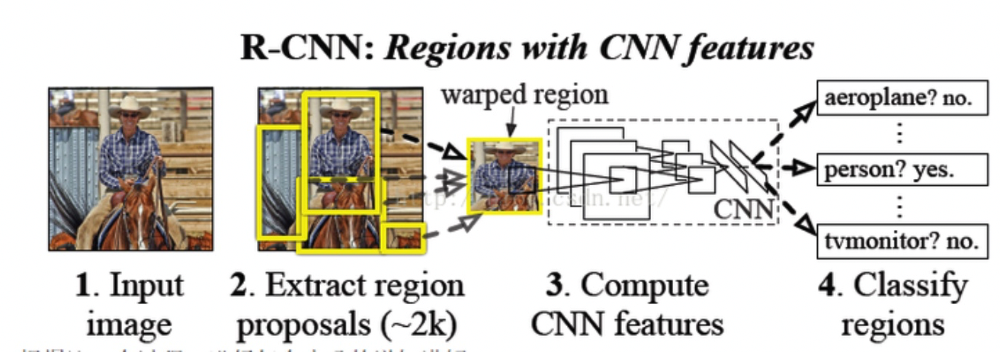
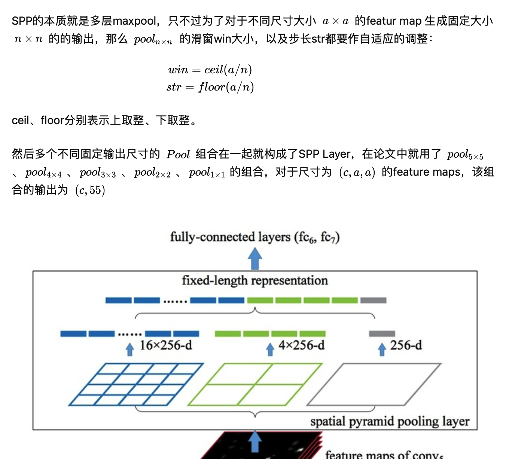
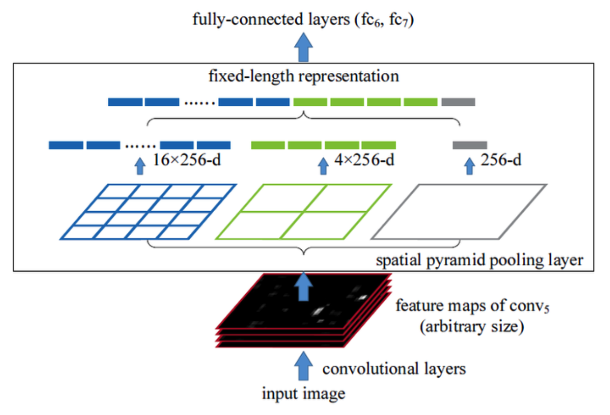

# awesome-ObjectDetection
经典的目标检测有关的工作整理

## 1.开山之作: RCNN，2013

### Pros:
第一个将深度学习引入od的工作，大幅度提升性能。

### 技术方法

这里的selective search就是一种基于图像有关的知识而进行处理的筛选region proposal的方法～
然后就是对这个区域进行缩放@形变，然后CNN feature进行分类/回归。

### 存在的问题Cons:

1. 尺寸归一化导致物体变形，纵横比特征的丢失。

2.重复使用网络计算特征，低实时性@单GPU就很耗时～

## 2.SPPNet@金字塔神经网络，2014(速度提升20倍）

### Pros:
1.这里就是之前的RCNN需要形变的问题，我们提出空间金字塔池化。（借鉴图像分割的思想）

2.这里就是我们可以搞定形变的问题，那么我们不需要再特地缩放网络架构了。训练方法就是我们按照某个尺度训练一遍，然后换一个尺度+之前weight再训练一遍。

3.同时这个可以提取不同尺寸的空间特征信息，可以提升模型对于空间布局和物体变形的鲁棒性。

4.可以避免将图片resize/crop成固定大小输入模型的弊端。resize的话会导致图片中的物体尺寸变形；crop则会导致图片不同位置的信息出现频率不均衡，例如图片中间的部分会比角落的部分会被CNN看到很多次。

 
 这里就是自适应来进行位置的取整～
 
### 技术方法:

### 缺陷cons:
1.仍然没有处理好对于单个image需要多次输入CNN的情况。

## 3.Fast RCNN@2015 ICCV
### 1.Motivation（不仅训练步骤变少了，而且也不需要将特征保存在磁盘上）
1.SPP和RCNN训练过程慢，我们必须先训练CNN+SVM+回归器。（训练分多步，而且RCNN/SPP都需要先finetuning一个预训练的网络，然后针对每个类别都需要训练一个SVM分类器，最后还要使用regressors对bbx进行一个回归+selective search）

2.需要较大的存储空间，训练SVM分类器时，需要将多维深度特征存储到硬盘上。

3.RCNN检测慢，每个区域重新计算特征,而且有大量的重叠框。SPPNet就是不能同时调整SPP-layer前后层的权重。（测试时候也比较慢，每个proposal都要卷积。）

4.同时这里使用SVD分解了一下全连接层，因为这里的全连接层基本上占了网络时间的一半。（因为每个proposal都要输入进去）

### 我们的改进方法（backbone VGG16）测试的过程就是softmax，然后每个类别NMS。
1.提出ROI Pooling Layer，可以在训练过程中同时调整前后层的权重。

2.网络中，同时完成分类和回归的任务。

### 核心思想@针对RCNN和SPP的改进（只运行一次CNN+还是使用了selective search）
我们可不可以在每张图片上只使用一次CNN就可以得到全部的重点关注区域呢，而不是运行2000次。

### 整个技术流程
1.输入图像；

2.图像被传递到卷积网络中，并且返回对应的感兴趣区域@RoI；

3.在区域上应用RoI池化层，保证每个区域的尺寸相同；

4.传递到一个FC层进行分类+回归。

### Cons:（速度还是不够理想@selective search）
1.仍然还是需要使用selective search，所以这个过程会花不少时间。与RCNN不同的是，Fast RCNN处理一张图片大约需要2s。但是在大型真实数据集上，这种速度仍然不够理想。

2.但是RoI Pooling也会损失很多信息，因为此时就算是feature map上的一个格子也可能包含很多信息。@所以就有RoIAlign.

